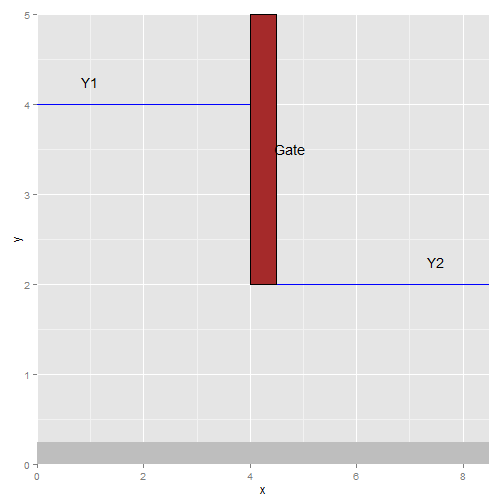

---
title       : Flow Rate Calculator 
subtitle    : Flow in a canal and force on a sluice gate
author      : YonasTH
framework   : io2012        # {io2012, html5slides, shower, dzslides, ...}
highlighter : highlight.js  # {highlight.js, prettify, highlight}
hitheme     : tomorrow      # 
widgets     : [quiz, mathjax]      # {mathjax, quiz, bootstrap}
mode        : selfcontained # {standalone, draft}
knit        : slidify::knit2slides

--- .class #id   

## What does the calculator do?
- Estimates flow of water in a canal which has a sluice gate to control flow    
- It also computes force of the water on the gate  
- Input required are the width of the canal and upstream and downstream depth of water  

--- .class #id 

## Basic Formulation  
Bernoulli's equation and momentum equations are used to estimate flow and force.
$$flow rate = \frac{b y_{1}\sqrt{2gy_{2}}}{\sqrt{\frac{y_{1}}{y_{2}}+1}}$$  
$$force = \rho b(V_{2}^2y_{2} - V_{1}^2y_{1}) - \rho gb\frac{y_{1}^2 -y_{2}^2}{2}$$
where $V_{1}$ and $V_{2}$ are upstream and downstream flow velocities given by $V_{1}= b y_{1}$ and $V_{2}= b y_{2}$, respectively  

--- .class #id   

## Sample Calculation and plot 
 

--- .class #id  

## Documentation  
### Inputs and Outputs  
Flow Rate calcualtor calculates volume of water flowing through a canal. It uses Bernoulli's equation to estimate flow underneath a sluice gate in a canal from measurements of water depth upstream and downstream of the gate. Additionaly, force exerted on the gate is calculated from the water depths.  

### Input Variables  
b = canal width  
y1 = upstream water depth  
y2 = downstream water depth  

### Notes   
- The calculator is limited to a canal with dimensions 5m x 5m x 5m. Therefore, the depths and width input can not exceed 5m.
